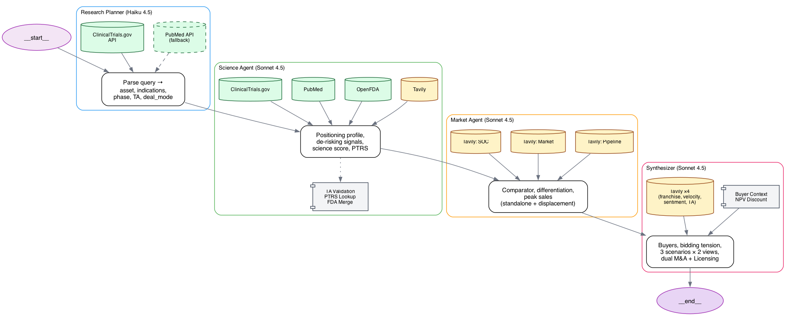

# BD Decision Intelligence

A multi-agent pharma BD valuation system that evaluates drug assets and produces dual-view deal pricing with dual deal modes (M&A + Licensing) and buyer mapping.

## What it does

Type any drug asset and get:
- **Science profile** — positioning, de-risking signals, adjusted PTRS (grounded by ClinicalTrials.gov, PubMed, OpenFDA)
- **Comparator analysis** — SOC discovery, metric comparison, differentiation verdict
- **Three-scenario valuation** — standalone NPV, platform displacement, strategic deal price
- **Dual deal economics** — M&A (upfront ≈ total) and Licensing (upfront + milestones + royalty NPV = total) side by side
- **Buyer mapping** — likely acquirers ranked by urgency (patent cliff + flush capital + deal velocity)
- **Dual-view output** — risk-adjusted (PTRS applied) and if-succeed (assumes approval)

## Architecture



Sequential pipeline — four agents, each with dedicated tools. Market agent reads PTRS from science agent, synthesizer reads everything.

- **Research planner** (Haiku 4.5) — searches ClinicalTrials.gov to ground the query, then parses asset/indications/phase/TA/deal_mode. PubMed fallback for preclinical assets.
- **Science agent** (Sonnet 4.5) — ClinicalTrials.gov + PubMed + OpenFDA + Tavily → positioning profile, de-risking signals, PTRS. TA validation corrects planner if ClinicalTrials.gov disagrees. FDA designations merged as ground truth.
- **Market agent** (Sonnet 4.5) — Tavily ×3 → comparator discovery, differentiation verdict, peak sales (standalone + displacement)
- **Synthesizer** (Sonnet 4.5) — Tavily ×4 + buyer urgency tables → buyer mapping, bidding tension, three scenarios, dual M&A + Licensing economics

**Tech stack**: FastAPI + LangGraph + Claude Sonnet 4.5 / Haiku 4.5 (AWS Bedrock), React + Vite + Tailwind

## Project structure

```
bd-intelligence/
├── backend/
│   ├── agents/           # research_planner, science_agent, market_agent, synthesizer, discovery_agent
│   ├── utils/            # ptrs_lookup, buyer_context, deal_benchmarks
│   ├── tools/            # clinicaltrials.py, pubmed.py, openfda.py (direct API clients)
│   ├── graph.py          # LangGraph sequential pipeline
│   ├── main.py           # FastAPI: /analyze, /analyze/stream, /recalculate
│   └── state.py          # IndicationAnalysis TypedDict + BDState
├── frontend/
│   └── src/components/   # ChatWindow, ResultCard, ValuationWaterfall, AssumptionsPanel, FilterSidebar
├── docs/
│   ├── architecture.md   # Full architecture with Mermaid diagrams
│   ├── agent_logic.md    # Detailed scoring rubric, formulas, tuning guide
│   ├── stategraph.png    # Pipeline visualization with tools per agent
│   └── technical_presentation_light.html  # 8-slide technical deck
└── tests/                # Real deal validation suite
```

## Setup

```bash
git clone https://github.com/codingnoodle/bd-intelligence-v2.git
cd bd-intelligence-v2
cp .env.example .env     # set LLM_PROVIDER, API keys, TAVILY_API_KEY
uv sync

# Backend
uv run uvicorn backend.main:app --host 0.0.0.0 --port 8000

# Frontend (separate terminal)
cd frontend && npm install && npm run dev
```

Backend: `http://localhost:8000` | Frontend: `http://localhost:5173`

## Validation

Tested against real 2025-2026 deals:

| Asset | Mode | Predicted Upfront | Actual | Predicted Total | Actual Total |
|---|---|---|---|---|---|
| TERN-701 (CML, Ph1/2) | M&A | $5.2B | $5.7B (Merck) | $6.5B | $5.7B |
| BNT327 (NSCLC, Ph3) | Licensing | $3.8B | $3.5B (BMS) | $12.7B | $11.1B |
| SYH2082 (Obesity, Ph1) | Licensing | $1.2B | $1.2B (AstraZeneca) | $6.5B | $18.5B* |

*AZ deal was for 8 programs, not just SYH2082.

## Key files

| File | What it does |
|---|---|
| `tools/clinicaltrials.py` | ClinicalTrials.gov API client (trials, conditions, endpoints) |
| `tools/pubmed.py` | PubMed E-utilities API client (search + fetch abstracts) |
| `tools/openfda.py` | OpenFDA API client (orphan, fast track, breakthrough designations) |
| `utils/ptrs_lookup.py` | Base PTRS table + `get_adjusted_ptrs()` with 9 de-risking signals |
| `utils/buyer_context.py` | Patent cliff (12 buyers) + flush capital (3 buyers) tables |
| `utils/deal_benchmarks.json` | 20 M&A + 7 licensing deals from 2025-2026 |
| `agents/synthesizer.py` | Buyer mapping, bidding tension, dual M&A/Licensing output |
| `docs/agent_logic.md` | Complete scoring rubric, formulas, tuning guide |
