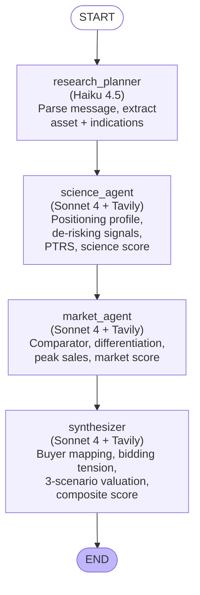
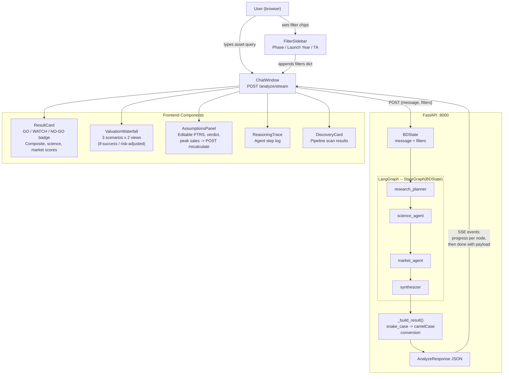
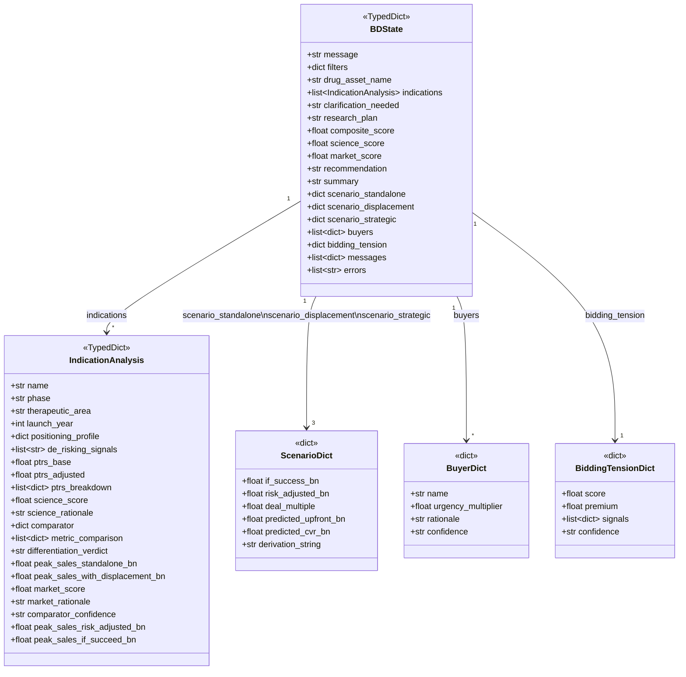
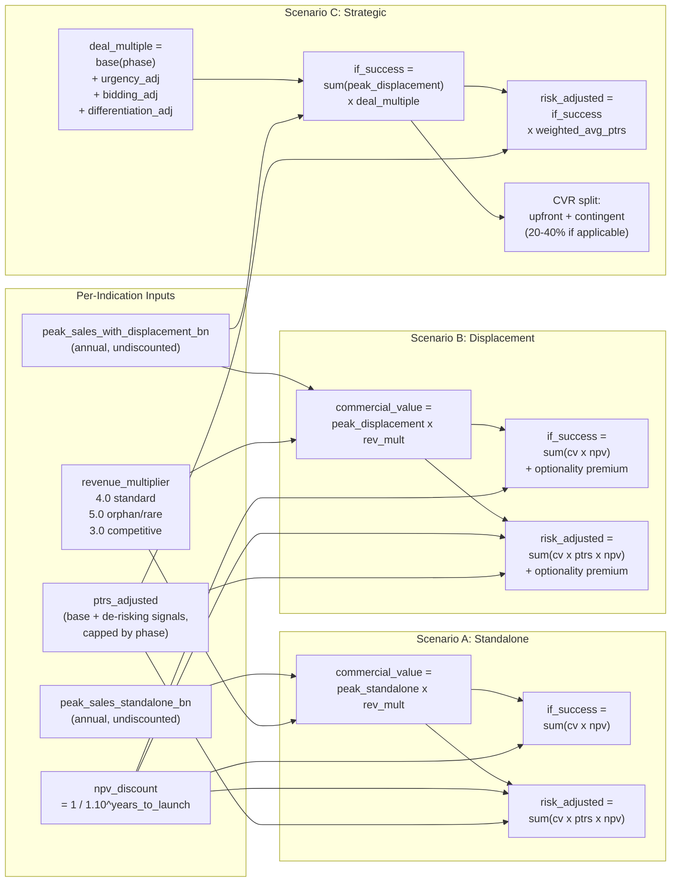

# BD Intelligence -- Multi-Agent System Architecture

## Overview

BD Intelligence is a four-agent sequential pipeline built on LangGraph that analyzes pharma drug assets for business development decisions. It produces per-indication science and market assessments, three-scenario valuations with dual-view (if-success vs. risk-adjusted), buyer mapping, and bidding tension analysis.

**Models used:**
- Research planner: Claude Haiku 4.5 (via AWS Bedrock or Anthropic API)
- Science agent, market agent, synthesizer: Claude Sonnet 4 (via AWS Bedrock or Anthropic API)

**External data:** Tavily search API (used directly by science agent, market agent, and synthesizer -- no MCP servers are active).

---

## 1. LangGraph Flow

Sequential pipeline. Market agent reads `ptrs_adjusted` written by science agent, so the agents cannot run in parallel.



---

## 2. Data Flow: User to API to Graph to Frontend



---

## 3. API Endpoints

| Method | Path | Description |
|--------|------|-------------|
| GET | `/` | Health check (returns version 0.3.0) |
| POST | `/analyze` | Full synchronous analysis; returns `AnalyzeResponse` |
| POST | `/analyze/stream` | SSE streaming; emits `progress` events per node, then `done` with full result. Also handles `discovery` queries (pipeline scan mode). |
| POST | `/recalculate` | Re-runs from market agent onward with user overrides (e.g., edited PTRS or verdict from AssumptionsPanel). Skips research planner and science agent. |

### Request/Response Models

- **AnalyzeRequest**: `{ message: str, filters: dict }`
- **RecalculateRequest**: `{ asset_name: str, indications: list[dict], overrides: dict }`
- **AnalyzeResponse**: `{ message: str, result: AnalyzeResult | null }`
- **AnalyzeResult**: contains `assetName`, `compositeScore`, `scienceScore`, `marketScore`, `recommendation`, `indications[]`, three scenario objects, `buyers[]`, `biddingTension`, `summary`

---

## 4. State Schema

### BDState (top-level graph state)



### Who writes what

| Field(s) | Written by |
|----------|-----------|
| `name`, `phase`, `therapeutic_area`, `launch_year` | research_planner |
| `positioning_profile`, `de_risking_signals`, `ptrs_base`, `ptrs_adjusted`, `ptrs_breakdown`, `science_score`, `science_rationale` | science_agent |
| `comparator`, `metric_comparison`, `differentiation_verdict`, `peak_sales_standalone_bn`, `peak_sales_with_displacement_bn`, `market_score`, `market_rationale`, `comparator_confidence` | market_agent |
| `peak_sales_risk_adjusted_bn`, `peak_sales_if_succeed_bn` (per-indication); all scenario dicts, `buyers`, `bidding_tension`, `composite_score`, `recommendation`, `summary` | synthesizer |

---

## 5. Valuation: Dual-View Three-Scenario Model

Every scenario produces two numbers side-by-side:
- **if_success_bn**: value assuming the drug succeeds (no PTRS discount)
- **risk_adjusted_bn**: expected value with PTRS probability discount

The gap between them shows the clinical risk.



### Deal Multiple Calculation (Strategic Scenario)

Base multiple by phase:

| Phase | Base Multiple |
|-------|-------------|
| Preclinical | 0.5 -- 1.0x |
| Phase 1 | 1.0 -- 1.5x |
| Phase 1/2 | 1.5 -- 2.5x |
| Phase 2 | 2.0 -- 3.5x |
| Phase 3 | 3.0 -- 5.0x |
| Marketed | 4.0 -- 8.0x |

Adjustments applied on top of base:

| Condition | Adjustment |
|-----------|-----------|
| Top buyer urgency >= 1.3 | +0.3x |
| Top buyer urgency >= 1.5 | +0.5x |
| Bidding tension >= 0.6 | +0.3x |
| Bidding tension >= 0.8 | +0.5x |
| best_in_class or new_class_creation | +0.3x |
| Platform / multi-indication | +0.3x |
| me_too or worse_in_class | -0.5x |

---

## 6. PTRS Computation

PTRS (Probability of Technical and Regulatory Success) is computed in Python (not by the LLM) via `ptrs_lookup.py`:

1. **Base PTRS**: looked up from `ptrs_table.json` by normalized `phase` x `therapeutic_area`
2. **De-risking adjustment**: additive bonuses from a fixed vocabulary of 9 signals, identified by the science agent LLM
3. **Cap**: hard ceiling per phase prevents unrealistic values

De-risking signals and their contributions:

| Signal | Contribution |
|--------|-------------|
| orphan_drug | +0.02 |
| fast_track | +0.03 |
| breakthrough_designation | +0.05 |
| patients_dosed_50plus | +0.03 |
| patients_dosed_100plus | +0.05 (mutually exclusive with 50plus) |
| best_in_class_efficacy | +0.07 |
| fda_registrational_alignment | +0.04 |
| biomarker_defined_population | +0.03 |
| platform_multi_indication | +0.02 |

Phase caps: preclinical 0.20, ind_enabling 0.25, phase1 0.45, phase1_2 0.55, phase2 0.65, phase2b 0.70, phase3 0.85, nda_submitted 0.95.

---

## 7. Scoring and Recommendation

```
composite_score = 0.60 x mean(science_scores) + 0.40 x mean(market_scores)
```

Adjusted +/- 1 for portfolio breadth (more indications = higher ceiling).

| Score | Recommendation |
|-------|---------------|
| >= 6.5 | **GO** |
| 4.5 -- 6.4 | **WATCH** |
| < 4.5 | **NO-GO** |

---

## 8. Buyer Analysis

The synthesizer runs four Tavily searches to gather buyer intelligence:
1. **Franchise fit**: which pharma companies have active franchises in the relevant TAs
2. **Deal velocity**: recent M&A activity for known patent-cliff buyers
3. **Analyst sentiment**: analyst coverage and price targets for the asset
4. **TA deal velocity**: total M&A volume in the therapeutic area

It combines this with a static buyer urgency table (`buyer_context.py`) containing patent cliff pressure and flush capital data for major pharma companies.

**Bidding tension** is scored 0--1 from four signals (each up to 0.25):
- Analyst coverage (3+ distinct mentions)
- Stock/deal movement (recent data readout buzz)
- Capable buyer count (3+ buyers with urgency >= 1.1)
- TA deal velocity (5+ deals > $1B in 12 months)

Premium mapping: 0.0--0.3 = 0%, 0.3--0.6 = 15%, 0.6--0.8 = 25%, 0.8--1.0 = 35%.

---

## 9. Frontend Components

| Component | Purpose |
|-----------|---------|
| `ChatWindow` | Main input; sends POST to `/analyze/stream`, displays SSE progress, routes result to child components |
| `ResultCard` | GO/WATCH/NO-GO badge, composite score, science and market score bars |
| `ValuationWaterfall` | Three scenarios (standalone, displacement, strategic) with if-success and risk-adjusted columns |
| `AssumptionsPanel` | Editable assumptions (PTRS, verdict, peak sales); triggers POST to `/recalculate` to re-run from market agent onward |
| `FilterSidebar` | Phase, launch year, and therapeutic area filter chips |
| `ReasoningTrace` | Displays agent step-by-step progress log |
| `DiscoveryCard` | Shows pipeline scan results when query type is "discovery" |
| `GuidedEntryForm` | Structured input form for asset details |

---

## 10. Discovery Mode

The `/analyze/stream` endpoint supports a second query type: **discovery**. When the research planner classifies the user message as a discovery query (e.g., "top Phase 2 oncology assets"), the stream endpoint:

1. Calls `run_discovery_agent(scan_criteria)` instead of running the full graph
2. Returns a list of candidate assets via the `DiscoveryCard` component
3. Users can then click "Run full diligence" on any candidate to trigger a full analysis

---

## 11. `/recalculate` Flow

When a user edits an assumption in the AssumptionsPanel:

1. Frontend sends current indications (with all science fields) plus the override to POST `/recalculate`
2. Backend applies the override to the specified indication field
3. Re-runs `run_market_agent()` (which reads the updated `ptrs_adjusted` and other science fields)
4. Re-runs `run_synthesizer()` on the market-enriched output
5. Returns the same `AnalyzeResult` shape as `/analyze`

This avoids a full pipeline re-run -- science agent results are preserved, only market and synthesis are recomputed.
