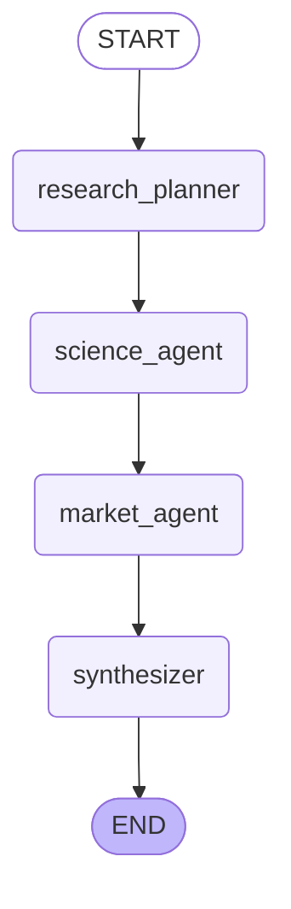
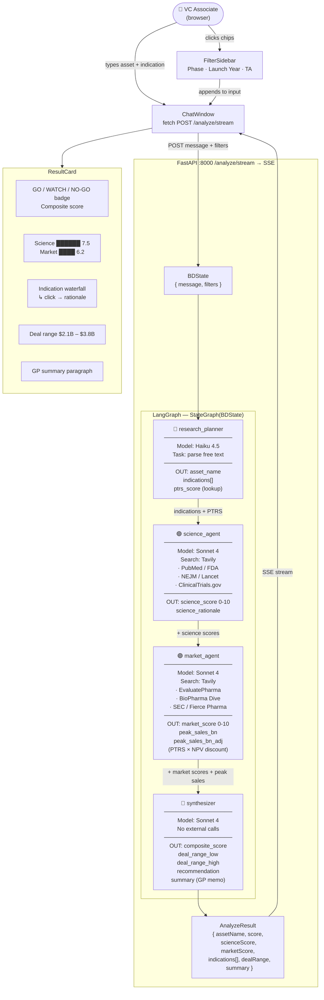
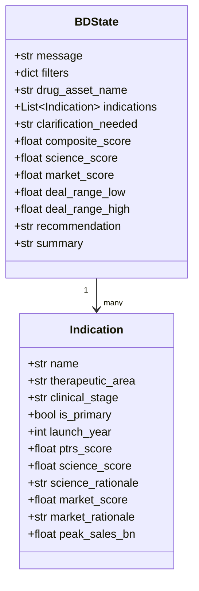
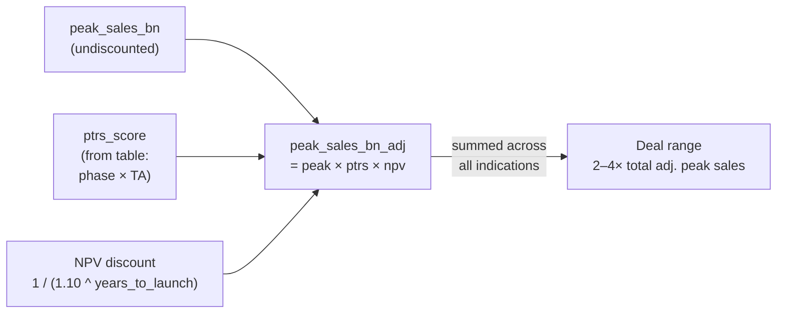
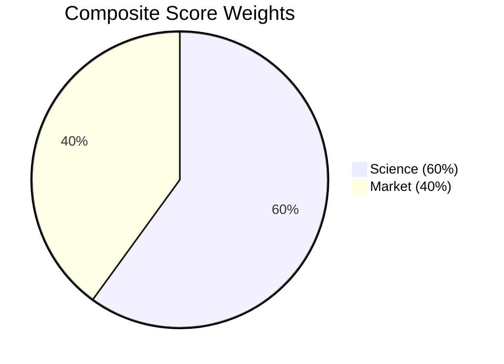

# BD Intelligence — Multi-Agent System Architecture

## LangGraph Flow (auto-generated from compiled graph)

---

## Full Data Flow Diagram

---

## State Schema

---

## PTRS × NPV Discount (market_agent)

---

## Scoring Weights (synthesizer)

| Score | Recommendation |
|-------|---------------|
| ≥ 6.5 | **GO** |
| 4.5 – 6.4 | **WATCH** |
| < 4.5 | **NO-GO** |
