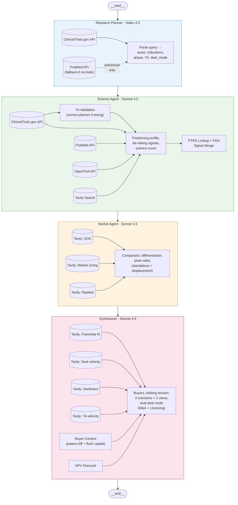
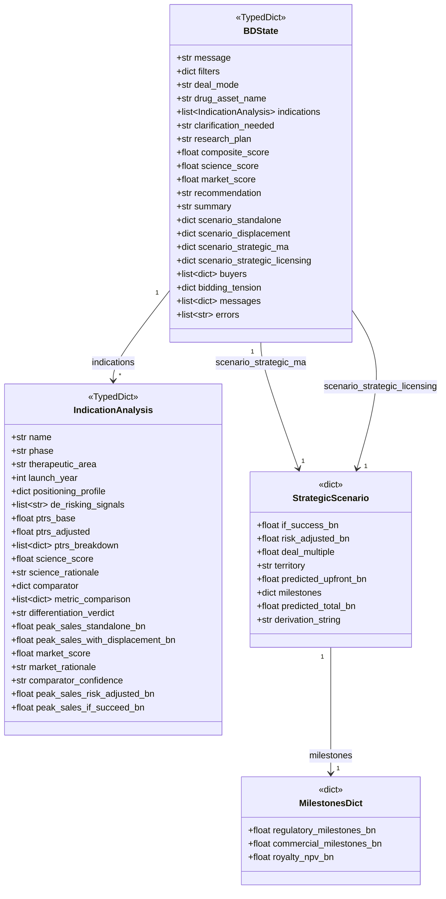
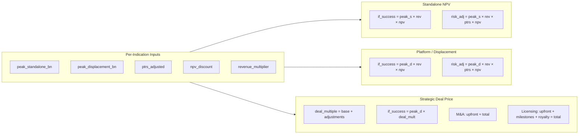

# BD Intelligence -- Multi-Agent System Architecture

## Overview

BD Intelligence is a four-agent sequential pipeline built on LangGraph that analyzes pharma drug assets for business development decisions. It produces per-indication science and market assessments, three-scenario valuations with dual-view (if-success vs. risk-adjusted), dual deal modes (M&A vs. Licensing), buyer mapping, and bidding tension analysis.

**Models used:**
- Research planner: Claude Haiku 4.5 (via AWS Bedrock or Anthropic API)
- Science agent, market agent, synthesizer: Claude Sonnet 4.5 (via AWS Bedrock or Anthropic API)

**External data sources:** ClinicalTrials.gov API, PubMed E-utilities API, OpenFDA API, Tavily search API. All are direct HTTP calls (not MCP tools).

---

## 1. LangGraph Flow with Tools

Sequential pipeline. Market agent reads `ptrs_adjusted` written by science agent, so the agents cannot run in parallel.


```mermaid
flowchart TD
    START([__start__]) --> RP

    subgraph RP["Research Planner · Haiku 4.5"]
        RP_CT[("ClinicalTrials.gov API")]
        RP_PM[("PubMed API\n(fallback if no trials)")]
        RP_LLM["Parse query →\nasset, indications,\nphase, TA, deal_mode"]
        RP_CT --> RP_LLM
        RP_PM -.->|"preclinical\nonly"| RP_LLM
    end

    RP --> SA

    subgraph SA["Science Agent · Sonnet 4.5"]
        SA_CT[("ClinicalTrials.gov API")]
        SA_PM[("PubMed API")]
        SA_FDA[("OpenFDA API")]
        SA_TAV[("Tavily Search")]
        SA_TA["TA Validation\n(correct planner if wrong)"]
        SA_PTRS["PTRS Lookup + FDA\nSignal Merge"]
        SA_LLM["Positioning profile,\nde-risking signals,\nscience score"]
        SA_CT --> SA_TA
        SA_TA --> SA_LLM
        SA_CT --> SA_LLM
        SA_PM --> SA_LLM
        SA_FDA --> SA_LLM
        SA_TAV --> SA_LLM
        SA_LLM --> SA_PTRS
    end

    SA --> MA

    subgraph MA["Market Agent · Sonnet 4.5"]
        MA_T1[("Tavily: SOC")]
        MA_T2[("Tavily: Market sizing")]
        MA_T3[("Tavily: Pipeline")]
        MA_LLM["Comparator, differentiation,\npeak sales\n(standalone + displacement)"]
        MA_T1 --> MA_LLM
        MA_T2 --> MA_LLM
        MA_T3 --> MA_LLM
    end

    MA --> SY

    subgraph SY["Synthesizer · Sonnet 4.5"]
        SY_T1[("Tavily: Franchise fit")]
        SY_T2[("Tavily: Deal velocity")]
        SY_T3[("Tavily: Sentiment")]
        SY_T4[("Tavily: TA velocity")]
        SY_BC["Buyer Context\n(patent cliff + flush capital)"]
        SY_NPV["NPV Discount"]
        SY_LLM["Buyers, bidding tension,\n3 scenarios × 2 views,\ndual deal mode\n(M&A + Licensing)"]
        SY_T1 --> SY_LLM
        SY_T2 --> SY_LLM
        SY_T3 --> SY_LLM
        SY_T4 --> SY_LLM
        SY_BC --> SY_LLM
        SY_NPV --> SY_LLM
    end

    SY --> END([__end__])

    style RP fill:#e8f4fd,stroke:#2196F3
    style SA fill:#e8f5e9,stroke:#4CAF50
    style MA fill:#fff3e0,stroke:#FF9800
    style SY fill:#fce4ec,stroke:#E91E63
```

---

## 2. Tool Summary

| Agent | Tool | Type | Purpose |
|-------|------|------|---------|
| Research Planner | ClinicalTrials.gov API | Direct HTTP | Ground planner with real trial conditions, phase, status |
| Research Planner | PubMed API | Direct HTTP | Fallback for preclinical assets — MOA, target from abstracts |
| Science Agent | ClinicalTrials.gov API | Direct HTTP | Trial design, endpoints, enrollment |
| Science Agent | PubMed API | Direct HTTP | Published efficacy/safety abstracts |
| Science Agent | OpenFDA API | Direct HTTP | Orphan, fast track, breakthrough designations (ground truth) |
| Science Agent | Tavily Search | Web search | Conference posters, news, data not in structured APIs |
| Science Agent | TA Validation | Code | Correct planner TA using ClinicalTrials.gov conditions |
| Science Agent | PTRS Lookup | Code | Base + adjusted probability from phase/TA/signals |
| Science Agent | FDA Signal Merge | Code | Inject FDA designations into de-risking signals |
| Market Agent | Tavily Search ×3 | Web search | SOC/comparators, market sizing, pipeline competitors |
| Synthesizer | Tavily Search ×4 | Web search | Franchise fit, deal velocity, sentiment, TA M&A velocity |
| Synthesizer | Buyer Context | Code | Patent cliff urgency + flush capital tables (12+ buyers) |
| Synthesizer | NPV Discount | Code | Time-value discount per indication |

**Note:** All tools are direct Python HTTP calls or code functions. None use MCP (Model Context Protocol). Tools are called deterministically in a fixed order — the LLM does not choose which tools to invoke.

---

## 3. Data Flow

```
User query
  → Research Planner: ClinicalTrials.gov + PubMed(fallback) → parse asset/indication/phase/TA/deal_mode
    → Science Agent: CT.gov + PubMed + OpenFDA + Tavily → positioning, PTRS, science score
      → Market Agent: Tavily ×3 → comparator, differentiation, peak sales
        → Synthesizer: Tavily ×4 + buyer tables → buyers, bidding, dual M&A/Licensing economics
          → Frontend: toggle Risk-adj / If-succeed × M&A / Licensing
```

---

## 4. API Endpoints

| Method | Path | Description |
|--------|------|-------------|
| GET | `/` | Health check (returns version) |
| POST | `/analyze` | Full synchronous analysis; returns `AnalyzeResponse` |
| POST | `/analyze/stream` | SSE streaming; emits `progress` events per node, then `done` with full result |
| POST | `/recalculate` | Re-runs from market agent onward with user overrides |

### Request/Response Models

- **AnalyzeRequest**: `{ message: str, filters: dict, deal_mode: str }`
- **RecalculateRequest**: `{ asset_name: str, indications: list[dict], overrides: dict, deal_mode: str }`
- **AnalyzeResponse**: `{ message: str, result: AnalyzeResult | null }`
- **AnalyzeResult**: contains `assetName`, `compositeScore`, `scienceScore`, `marketScore`, `recommendation`, `indications[]`, `scenarioStandalone`, `scenarioDisplacement`, `scenarioStrategicMa`, `scenarioStrategicLicensing`, `buyers[]`, `biddingTension`, `summary`

---

## 5. State Schema

### BDState (top-level graph state)


```mermaid
classDiagram
    class BDState {
        <<TypedDict>>
        +str message
        +dict filters
        +str deal_mode
        +str drug_asset_name
        +list~IndicationAnalysis~ indications
        +str clarification_needed
        +str research_plan
        +float composite_score
        +float science_score
        +float market_score
        +str recommendation
        +str summary
        +dict scenario_standalone
        +dict scenario_displacement
        +dict scenario_strategic_ma
        +dict scenario_strategic_licensing
        +list~dict~ buyers
        +dict bidding_tension
        +list~dict~ messages
        +list~str~ errors
    }

    class IndicationAnalysis {
        <<TypedDict>>
        +str name
        +str phase
        +str therapeutic_area
        +int launch_year
        +dict positioning_profile
        +list~str~ de_risking_signals
        +float ptrs_base
        +float ptrs_adjusted
        +list~dict~ ptrs_breakdown
        +float science_score
        +str science_rationale
        +dict comparator
        +list~dict~ metric_comparison
        +str differentiation_verdict
        +float peak_sales_standalone_bn
        +float peak_sales_with_displacement_bn
        +float market_score
        +str market_rationale
        +str comparator_confidence
        +float peak_sales_risk_adjusted_bn
        +float peak_sales_if_succeed_bn
    }

    class StrategicScenario {
        <<dict>>
        +float if_success_bn
        +float risk_adjusted_bn
        +float deal_multiple
        +str territory
        +float predicted_upfront_bn
        +dict milestones
        +float predicted_total_bn
        +str derivation_string
    }

    class MilestonesDict {
        <<dict>>
        +float regulatory_milestones_bn
        +float commercial_milestones_bn
        +float royalty_npv_bn
    }

    BDState "1" --> "*" IndicationAnalysis : indications
    BDState "1" --> "1" StrategicScenario : scenario_strategic_ma
    BDState "1" --> "1" StrategicScenario : scenario_strategic_licensing
    StrategicScenario "1" --> "1" MilestonesDict : milestones
```

### Who writes what

| Field(s) | Written by |
|----------|-----------|
| `name`, `phase`, `therapeutic_area`, `launch_year`, `deal_mode` | research_planner |
| `positioning_profile`, `de_risking_signals`, `ptrs_base`, `ptrs_adjusted`, `ptrs_breakdown`, `science_score`, `science_rationale` | science_agent |
| `therapeutic_area` (correction) | science_agent (TA validation from ClinicalTrials.gov) |
| `comparator`, `metric_comparison`, `differentiation_verdict`, `peak_sales_standalone_bn`, `peak_sales_with_displacement_bn`, `market_score`, `market_rationale`, `comparator_confidence` | market_agent |
| `peak_sales_risk_adjusted_bn`, `peak_sales_if_succeed_bn` (per-indication); `scenario_strategic_ma`, `scenario_strategic_licensing`, `scenario_standalone`, `scenario_displacement`, `buyers`, `bidding_tension`, `composite_score`, `recommendation`, `summary` | synthesizer |

---

## 6. Dual Deal Modes

The synthesizer always computes **both** M&A and Licensing economics for the strategic scenario. Users toggle between them in the frontend.

| Aspect | M&A | Licensing |
|--------|-----|-----------|
| **Structure** | Buyer acquires entire company/asset | Buyer licenses program, often for specific territory |
| **Territory** | Always worldwide | worldwide / ex-US / ex-China / ex-Japan |
| **Upfront** | ≈ total (buyer takes all risk) | 25-50% of total (risk shared via milestones) |
| **Regulatory milestones** | Small CVR/earnout ($0-1B) | $200-500M per indication per milestone |
| **Commercial milestones** | Rare (typically 0) | $300-800M across sales tiers |
| **Royalty NPV** | 0 (buyer owns 100%) | 15-30% of net sales over patent life |
| **Total** | ≈ upfront | upfront + reg + comm + royalty (2-3x upfront) |

---

## 7. Valuation: Dual-View Three-Scenario Model

Every scenario produces two numbers side-by-side:
- **if_success_bn**: value assuming the drug succeeds (no PTRS discount)
- **risk_adjusted_bn**: expected value with PTRS probability discount


```mermaid
flowchart LR
    subgraph Inputs["Per-Indication Inputs"]
        PEAK_S["peak_standalone_bn"]
        PEAK_D["peak_displacement_bn"]
        PTRS["ptrs_adjusted"]
        NPV["npv_discount"]
        REVMUL["revenue_multiplier"]
    end

    subgraph A["Standalone NPV"]
        A_IF["if_success = peak_s × rev × npv"]
        A_RA["risk_adj = peak_s × rev × ptrs × npv"]
    end

    subgraph B["Platform / Displacement"]
        B_IF["if_success = peak_d × rev × npv"]
        B_RA["risk_adj = peak_d × rev × ptrs × npv"]
    end

    subgraph C["Strategic Deal Price"]
        C_DM["deal_multiple = base + adjustments"]
        C_IF["if_success = peak_d × deal_mult"]
        C_MA["M&A: upfront ≈ total"]
        C_LIC["Licensing: upfront + milestones + royalty = total"]
    end

    Inputs --> A
    Inputs --> B
    Inputs --> C
```

### Deal Multiple Calculation

| Phase | Base Multiple |
|-------|-------------|
| Preclinical | 0.5 -- 1.0x |
| Phase 1 | 1.0 -- 1.5x |
| Phase 1/2 | 1.5 -- 2.5x |
| Phase 2 | 2.0 -- 3.5x |
| Phase 3 | 3.0 -- 5.0x |
| Marketed | 4.0 -- 8.0x |

Adjustments: urgency (up to +0.5x), bidding tension (up to +0.5x), best_in_class (+0.3x), platform (+0.3x), me_too (-0.5x).

---

## 8. PTRS Computation

PTRS is computed in Python (not by LLM) via `ptrs_lookup.py`:

1. **Base PTRS**: from `ptrs_table.json` by `phase × therapeutic_area`
2. **De-risking adjustment**: additive bonuses from 9 signals (identified by science agent LLM, supplemented by OpenFDA ground truth)
3. **Phase caps**: preclinical 0.20, phase1 0.45, phase1_2 0.55, phase2 0.65, phase3 0.85, nda 0.95

| Signal | Contribution |
|--------|-------------|
| orphan_drug | +0.02 |
| fast_track | +0.03 |
| breakthrough_designation | +0.05 |
| patients_dosed_50plus | +0.03 |
| patients_dosed_100plus | +0.05 |
| best_in_class_efficacy | +0.07 |
| fda_registrational_alignment | +0.04 |
| biomarker_defined_population | +0.03 |
| platform_multi_indication | +0.02 |

---

## 9. Scoring and Recommendation

```
composite_score = 0.60 × mean(science_scores) + 0.40 × mean(market_scores)
```

| Score | Recommendation |
|-------|---------------|
| >= 6.5 | **GO** |
| 4.5 -- 6.4 | **WATCH** |
| < 4.5 | **NO-GO** |

---

## 10. Frontend Components

| Component | Purpose |
|-----------|---------|
| `ChatWindow` | Main input; SSE streaming; routes results to child components |
| `ResultCard` | GO/WATCH/NO-GO badge, composite/science/market scores |
| `ValuationWaterfall` | 3 scenarios × 2 views (risk-adj / if-succeed) + M&A / Licensing toggle |
| `AssumptionsPanel` | Editable assumptions; triggers `/recalculate` |
| `FilterSidebar` | Phase, launch year, TA filter chips |
| `ReasoningTrace` | Agent step-by-step progress log |
| `DiscoveryCard` | Pipeline scan results (discovery mode) |
| `GuidedEntryForm` | Structured input form for asset details |
